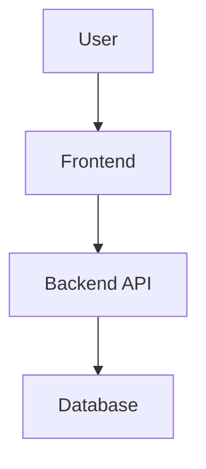

# 🎨 Hackathon README Design Guide
## Making Your Project Stand Out Like Guardian Gear

---

## 📐 DESIGN CARD - README Structure Blueprint

### **1. HERO SECTION** (First Impression - 10 seconds)
```
┌─────────────────────────────────────────────────┐
│  🛡️ [PROJECT LOGO/ICON]                         │
│  PROJECT NAME (Large, Bold)                     │
│  Catchy One-Liner Subtitle                      │
│  [Tech Stack Badges - Horizontal Row]           │
│  • Key Link | • Key Link | • Key Link           │
└─────────────────────────────────────────────────┘
```

**Visual Elements:**
- Custom logo/icon (emoji or designed graphic)
- Tech stack badges (shields.io)
- Quick navigation links
- Brief tagline that sells the problem you solve

---

### **2. IMPACT STATEMENT** (Why This Matters)
```
🏆 Built for [Context]. Designed for [Purpose].
```

**Format:**
- Emoji + Bold statement
- 1-2 sentences max
- Creates immediate context

---

### **3. PROBLEM-SOLUTION SPLIT** (The Hook)

**LEFT COLUMN - The Problem:**
```
💡 The Problem We Solve
❌ Pain Point 1
❌ Pain Point 2  
❌ Pain Point 3
```

**RIGHT COLUMN - Your Solution:**
```
✨ Our Solution
✅ Solution Feature 1
✅ Solution Feature 2
✅ Solution Feature 3
```

**Visual Strategy:**
- Use tables or columns
- Red ❌ vs Green ✅ creates visual contrast
- Keep it scannable (3-5 points each)

---

### **4. VISUAL SHOWCASE** (Screenshots/Demos)

**A. Architecture Diagram**
```
[System Architecture Flowchart]
Caption: "Complete system architecture showing frontend ↔ backend ↔ database flow"
```

**B. Database Schema Diagram**
```
[Entity Relationship Diagram]
Caption: "Data relationships and schema design"
```

**C. Application Screenshots**
```
┌──────────────┬──────────────┬──────────────┐
│ Screenshot 1 │ Screenshot 2 │ Screenshot 3 │
│  (Login)     │  (Dashboard) │  (Feature)   │
└──────────────┴──────────────┴──────────────┘
```

**D. Demo GIF/Video**
```
[Animated Demo GIF - 10-15 seconds]
Caption: "Watch the complete workflow in action"
```

---

### **5. FEATURES SECTION** (Organized Categories)

**Format:**
```
🚀 Core Features

🎨 Category 1 Name
├── Feature with icon + brief description
├── Feature with technical detail
└── Feature highlighting innovation

🔐 Category 2 Name
├── Security feature
├── Performance metric
└── Unique capability
```

**Visual Rules:**
- Group related features
- Use emojis for visual separation
- Add sub-bullets for technical depth
- Include metrics when possible

---

### **6. TECH STACK VISUALIZATION**

**Format 1 - Tree Structure:**
```
🎨 Frontend Excellence
React 18 + Vite 5 + Tailwind CSS 3
├── 🎭 Framer Motion        → Animation library
├── 🔄 React Router         → Navigation
├── 📡 Axios                → API calls
└── 🎨 Component Library    → UI toolkit
```

**Format 2 - Badges:**
```
  
```

---

### **7. QUICK START** (Easy Onboarding)

**Structure:**
```
📋 Prerequisites
✅ Requirement 1
✅ Requirement 2

🚀 Installation

1️⃣ Clone the Repository
[Code block with syntax highlighting]

2️⃣ Backend Setup
[Step-by-step with commands]

3️⃣ Frontend Setup  
[Step-by-step with commands]

🎭 Demo Credentials
[Table with roles and login info]
```

**Visual Strategy:**
- Number steps clearly
- Use code blocks with language highlighting
- Include checkmarks for prerequisites
- Provide demo accounts for judges

---

### **8. INNOVATION HIGHLIGHTS**

**Format:**
```
💡 Key Innovation Highlights

🎨 Category 1
✅ Innovation point with metric
✅ Unique approach explanation
✅ Competitive advantage

🧠 Category 2
✅ Technical achievement
✅ Problem solved elegantly
```

---

### **9. ARCHITECTURE DIAGRAMS**

**Include:**
- System architecture flowchart
- Database ER diagram
- State machine diagram
- API flow diagram

**Placement:**
- After features, before Quick Start
- Use collapsible sections for long diagrams
- Add descriptive captions

---

### **10. API DOCUMENTATION** (If Applicable)

**Format:**
```
📡 API Documentation

🔐 Authentication Endpoints
| Method | Endpoint | Description | Access |
|--------|----------|-------------|--------|
| POST   | /login   | Login user  | Public |
```

**Visual Strategy:**
- Use tables for endpoints
- Color-code by method (GET=blue, POST=green)
- Include access levels

---

### **11. ROADMAP** (Future Vision)

**Format:**
```
🗺️ Roadmap & Future Enhancements

✅ Completed (Phase 1)
✅ Feature 1
✅ Feature 2

🔄 In Progress (Phase 2)
🔄 Feature 3
🔄 Feature 4

💡 Future Vision (Phase 3)
💡 AI Integration
💡 Mobile App
```

---

### **12. PERFORMANCE METRICS** (Impress Judges)

**Format:**
```
📈 Performance Metrics

| Metric              | Target   | Achieved | Status     |
|---------------------|----------|----------|------------|
| API Response Time   | < 200ms  | ~150ms   | ✅ Excellent|
| Frontend Load       | < 2s     | ~1.5s    | ✅ Excellent|
| Lighthouse Score    | > 90     | 95       | ✅ Excellent|
```

---

### **13. FOOTER** (Professional Touch)

**Format:**
```
🏆 Built for [Hackathon]. Designed for Production.

[Project Name] - [Tagline]

[Social Badges: Stars | Forks | License]

Made with ❤️ by [Your Name/Team]
```

---

## 🛠️ TOOLS & RESOURCES FOR VISUAL CREATION

### **📊 DIAGRAM CREATION TOOLS**

#### **1. Excalidraw** ⭐ HIGHLY RECOMMENDED
- **URL:** https://excalidraw.com
- **Use For:** Architecture diagrams, flowcharts, system design
- **Why:** 
  - Hand-drawn style looks professional yet approachable
  - Free, no signup required
  - Export as PNG/SVG
  - Collaborative editing
  - Used by Guardian Gear for their architecture diagram
- **Best For:** System architecture, data flow diagrams

#### **2. Draw.io (diagrams.net)** ⭐ BEST FOR ER DIAGRAMS
- **URL:** https://app.diagrams.net
- **Use For:** Database schemas, ER diagrams, UML diagrams
- **Why:**
  - Professional templates
  - Database/ER diagram templates built-in
  - Export high-quality PNG/SVG
  - Integrates with GitHub
- **Best For:** Database design, entity relationships

#### **3. Mermaid** ⭐ CODE-BASED DIAGRAMS
- **URL:** https://mermaid.live
- **Use For:** Flowcharts, state diagrams, Gantt charts
- **Why:**
  - Text-to-diagram (markdown syntax)
  - Renders directly in GitHub README
  - Version controllable
  - No external images needed
- **Example:**

- **Best For:** State machines, simple flows

#### **4. Figma** ⭐ PROFESSIONAL DESIGN
- **URL:** https://figma.com
- **Use For:** UI mockups, high-fidelity designs, logos
- **Why:**
  - Professional design tool
  - Free tier available
  - Component libraries
  - Export in any format
- **Best For:** App screenshots, UI design showcase

---

### **📸 SCREENSHOT & MOCKUP TOOLS**

#### **5. Screely** ⭐ INSTANT BEAUTIFUL SCREENSHOTS
- **URL:** https://screely.com
- **Use For:** Adding browser mockups to screenshots
- **Why:**
  - Instant browser window frames
  - Custom backgrounds
  - No watermark
  - Free
- **Best For:** Making screenshots look professional

#### **6. Carbon** ⭐ CODE SCREENSHOTS
- **URL:** https://carbon.now.sh
- **Use For:** Beautiful code snippets
- **Why:**
  - Syntax highlighting
  - Multiple themes
  - Export as PNG/SVG
  - Looks premium
- **Best For:** Showing code examples in README

#### **7. Shots.so** ⭐ MOCKUP GENERATOR
- **URL:** https://shots.so
- **Use For:** Device mockups (phone, laptop, tablet)
- **Why:**
  - Free mockup generator
  - Multiple device types
  - Gradient backgrounds
  - Quick export
- **Best For:** Mobile/responsive design showcase

---

### **🎬 GIF & VIDEO CREATION**

#### **8. ScreenToGif** ⭐ BEST FOR WINDOWS
- **URL:** https://www.screentogif.com
- **Use For:** Recording workflow GIFs
- **Why:**
  - Free, open-source
  - Built-in editor
  - Small file sizes
  - No watermark
- **Best For:** Feature demonstrations

#### **9. Kap** ⭐ BEST FOR MAC
- **URL:** https://getkap.co
- **Use For:** Recording screen to GIF/MP4
- **Why:**
  - Lightweight
  - Free
  - Easy to use
  - High quality output
- **Best For:** Mac users creating demos

#### **10. LICEcap** ⭐ CROSS-PLATFORM
- **URL:** https://www.cockos.com/licecap/
- **Use For:** Simple GIF recording
- **Why:**
  - Cross-platform
  - Tiny file size
  - Simple interface
  - Free
- **Best For:** Quick, lightweight GIFs

#### **11. OBS Studio** ⭐ PROFESSIONAL RECORDING
- **URL:** https://obsproject.com
- **Use For:** High-quality video recording
- **Why:**
  - Professional streaming/recording
  - Free, open-source
  - Multiple scenes
  - Best quality
- **Best For:** Demo videos, tutorials

---

### **🎨 BADGE & ICON RESOURCES**

#### **12. Shields.io** ⭐ TECH STACK BADGES
- **URL:** https://shields.io
- **Use For:** Technology badges
- **Example:** ``
- **Best For:** Tech stack showcase

#### **13. Simple Icons** ⭐ BRAND LOGOS
- **URL:** https://simpleicons.org
- **Use For:** Getting exact brand colors and icons
- **Why:**
  - Official brand colors
  - SVG logos
  - Integrates with Shields.io
- **Best For:** Consistent branding in badges

#### **14. Lucide Icons / Heroicons** ⭐ README ICONS
- **Lucide:** https://lucide.dev
- **Heroicons:** https://heroicons.com
- **Use For:** Section icons, feature icons
- **Why:**
  - Modern, clean icons
  - Free, open-source
  - Consistent style
- **Best For:** Visual hierarchy in README

---

### **🎥 VIDEO HOSTING**

#### **15. GitHub Assets** ⭐ DIRECT EMBEDDING
- **Method:** Drag and drop directly into GitHub issue/README editor
- **Use For:** GIFs, images, videos
- **Why:**
  - No external hosting needed
  - Fast loading
  - Reliable
- **Best For:** Small GIFs and images

#### **16. YouTube** ⭐ DEMO VIDEOS
- **URL:** https://youtube.com
- **Use For:** Longer demo videos (2+ minutes)
- **Why:**
  - Unlimited hosting
  - Embeddable
  - Professional
- **Best For:** Full project walkthroughs

---

### **🎯 LOGO & ICON CREATION**

#### **17. Canva** ⭐ QUICK LOGO DESIGN
- **URL:** https://canva.com
- **Use For:** Project logos, banners, thumbnails
- **Why:**
  - Templates available
  - Free tier sufficient
  - Easy to use
  - Export PNG/SVG
- **Best For:** Non-designers creating graphics

#### **18. Logo.com / Looka** ⭐ AI LOGO GENERATION
- **Logo.com:** https://logo.com
- **Looka:** https://looka.com
- **Use For:** AI-generated logos
- **Why:**
  - Quick generation
  - Multiple options
  - Professional results
- **Note:** May require payment for full resolution

---

### **📐 COLOR PALETTE & DESIGN**

#### **19. Coolors** ⭐ COLOR SCHEMES
- **URL:** https://coolors.co
- **Use For:** Generating cohesive color palettes
- **Why:**
  - Quick palette generation
  - Export formats
  - Accessibility checker
- **Best For:** Consistent visual theming

#### **20. Contrast Checker** ⭐ ACCESSIBILITY
- **URL:** https://webaim.org/resources/contrastchecker/
- **Use For:** Ensuring readable color combinations
- **Why:**
  - WCAG compliance
  - Professional appearance
- **Best For:** Dark themes, badge colors

---

## 🎯 QUICK WORKFLOW FOR TOMORROW

### **🕐 1 Hour Before Hackathon:**
1. **Choose 3-4 colors** for your theme (Coolors.co)
2. **Create a simple logo** (Canva - 15 mins)
3. **Prepare screenshot templates** (Screely.com)

### **⏰ During Development:**
1. **Take screenshots** as you build features
2. **Record 10-second GIFs** of key interactions (ScreenToGif/Kap)
3. **Save architecture notes** for diagram creation

### **🏁 Final 2 Hours:**
1. **Architecture diagram** (Excalidraw - 30 mins)
2. **Database schema** (Draw.io - 20 mins)
3. **Assemble README** using design card structure (40 mins)
4. **Add GIFs and polish** (30 mins)

---

## 💡 PRO TIPS FOR HACKATHON README

### **Visual Hierarchy:**
✅ Use headers (H1 → H6) strategically
✅ White space is your friend
✅ Consistent emoji usage (don't overdo it)
✅ Tables for structured data
✅ Code blocks with syntax highlighting

### **Content Strategy:**
✅ Problem → Solution → Demo flow
✅ Show, don't tell (GIFs > paragraphs)
✅ Include metrics when possible
✅ Make it scannable in 60 seconds
✅ Demo credentials clearly visible

### **Technical Credibility:**
✅ Architecture diagrams show planning
✅ Database schema shows data thinking
✅ API docs show completeness
✅ Code quality screenshots
✅ Performance metrics

### **Judge Appeal:**
✅ Clear problem statement (they understand "why")
✅ Visual demos (they see it working)
✅ Technical depth (they see complexity)
✅ Future vision (they see potential)
✅ Easy to test (demo credentials prominent)

---

## 🔗 EXAMPLE TEMPLATE STRUCTURE

```markdown
# 🛡️ Your Amazing Project
One-liner that sells the problem you solve

  

• [Live Demo](#) • [Documentation](#) • [Video](#)

---

## 🎯 The Challenge
❌ Current problem 1
❌ Current problem 2
❌ Current problem 3

## ✨ Our Solution  
✅ How you solve it 1
✅ How you solve it 2
✅ How you solve it 3

---

## 🎬 See It In Action
[GIF/Screenshot showcase]

---

## 🚀 Features

### 🎨 Beautiful UI
- Feature detail
- Feature detail

### 🔐 Secure
- Security feature
- Security feature

---

## 🏗️ Architecture
[Architecture diagram from Excalidraw]

---

## ⚡ Quick Start
[Step-by-step installation]

🎭 Demo Accounts:
| Role | Email | Password |
|------|-------|----------|

---

## 📊 Performance
| Metric | Achievement |
|--------|-------------|

---

## 🗺️ What's Next
Future vision points

---

Made with ❤️ for [Hackathon Name]
```

---

## 🎨 VISUAL EXAMPLES TO STUDY

**Great Hackathon READMEs:**
1. Guardian Gear (you already have this)
2. https://github.com/kamranahmedse/developer-roadmap
3. https://github.com/sindresorhus/awesome
4. https://github.com/github/gitignore

**Study These For:**
- Visual hierarchy
- Diagram placement
- Badge usage
- GIF integration
- Table formatting

---

## ⚡ EMERGENCY SHORTCUTS (If Time is Tight)

**30-Minute README:**
1. Use Guardian Gear structure as template
2. Excalidraw architecture diagram (10 mins)
3. ScreenToGif demo (10 mins)  
4. Fill in content (10 mins)

**1-Hour README (Recommended):**
1. Design card structure above (15 mins)
2. Excalidraw + Draw.io diagrams (20 mins)
3. Screenshots with Screely (10 mins)
4. Write and assemble (15 mins)

**2-Hour README (Impressive):**
- Follow full design card
- Multiple diagrams
- Professional screenshots
- GIF demos
- Complete documentation

---

## ✅ FINAL CHECKLIST

Before submitting:
- [ ] Logo/header looks professional
- [ ] Problem-solution is clear
- [ ] Visual demo (GIF/screenshots) included
- [ ] Architecture diagram present
- [ ] Tech stack clearly shown
- [ ] Quick start works (test it!)
- [ ] Demo credentials provided
- [ ] Future vision included
- [ ] No spelling errors
- [ ] Mobile-friendly (GitHub renders well)

---

**🎯 Remember:** Judges spend 2-3 minutes per README. Make those seconds count!

**Good luck with your hackathon! 🚀**
